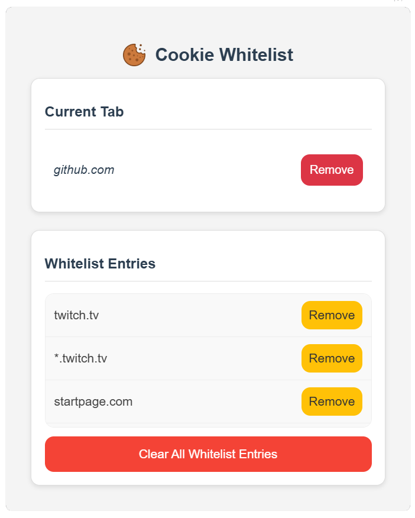

# Cookie Cleaner

## About The Extension
This Plugin deletes all cookies and data from the browser, unless it is whitelisted. Also deletes history and cache, when browser window is closed.

 

## Security
* Manifest V3 compatible
* No Data collection
* Open-Source

## Usage
1. Activate Developer Mode
2. Click "Load unpacked"
3. Find Folder on your disk

## Thanks to
* [UXWing.com](https://uxwing.com/cookie-icon/): You can download the cookie icon from here
